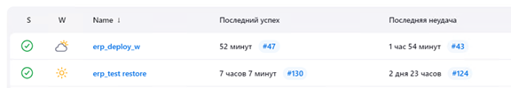
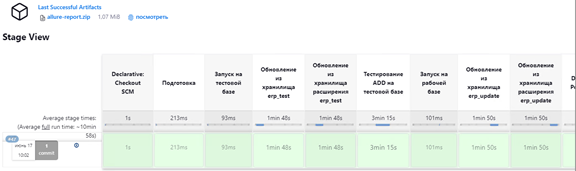

# Проект автоматизации обновления баз данных 1С:Предприятие с помощью Jenkins
## Благодарности
Спавибо https://github.com/ripreal/erp_features на основе которого был сделан этот проект.

## Введение
Данный документ описывает процесс автоматизации работы с базами данных 1С:Предприятие с использованием Jenkins. Цель проекта - автоматизация обновления тестовой и рабочей базы данных, запуск тестов и генерация отчетов.

## Процессы

### Обновление тестовой базы данных (erp_test restore)
- **Время запуска**: 02:00
- **Шаги выполнения**:
  1. Развертывание копии рабочей базы в тестовую базу `erp_test` из последнего бэкапа сетевой шары.
  2. Подключение тестовой базы к хранилищу и хранилищу расширения.
  3. Обновление тестовой базы.
  4. Обрезание и сжатие (шринк) базы данных.
  5. Удаление предыдущего бэкапа.
  6. Создание нового бэкапа тестовой базы.

- **Сценарий выполнения**:
  - Копирование базы осуществляется через MS SQL скрипт.
  - Подключение к хранилищу через команду пакетного запуска 1С.
  - Обрезание и сжатие базы выполняются с помощью MS SQL скрипта.
  - Создание бэкапа также выполняется через MS SQL скрипт.

### Обновление рабочей базы данных после тестирования (erp_deploy_w)
- **Время запуска**: 21:20
- **Шаги выполнения**:
  1. Обновление `erp_test` из хранилища и хранилища расширения.
  2. Запуск тестов с использованием `vanessa`.
  3. Создание отчета с помощью Allure.
  4. Обновление рабочей базы в случае успешного прохождения тестов.

## Мониторинг и результаты
Результаты работы jobов можно увидеть на сервере `srv-sql-ls` под пользователем `support1c`:

  Обратите внимание на зеленую галочку в колонке S и на время последнего успеха/неудачи. Детали ошибок и статус выполнения задач можно просмотреть, кликнув на интересующую задачу.
  
